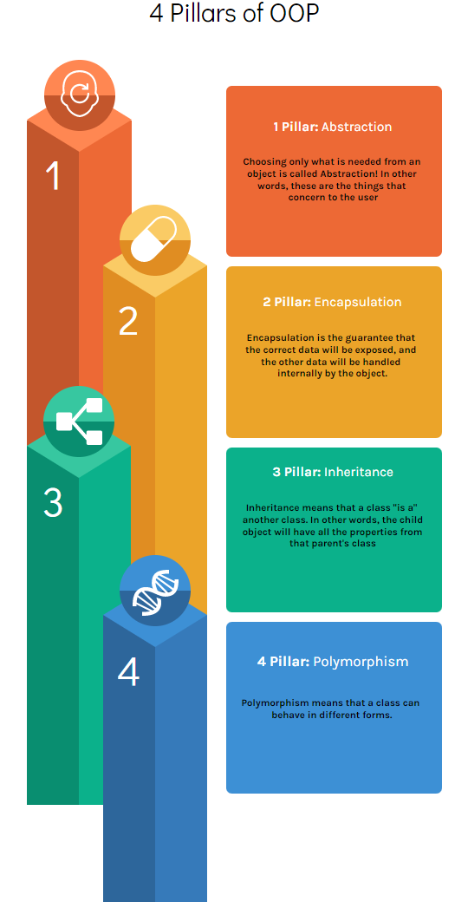

# 4 Pillars of Object-Oriented Programming

Before we talk about the 4 pillars of OOP, let's understand what is Object-Oriented Programming.

### What is Object-Oriented Programming

Object-Oriented Programming is one paradigm of programming language. This paradigm tries to solve problems based on objects.

Basically, an object is a component that can have attributes and actions. These attributes and actions will help the system deal with real-world problems. One example of an object can be a person, one person can have a name, date of birth, and contacts. Contacts can be another object, and this object can have multiple attributes too, like email, phone...

There are other types of paradigms like Functional, Procedural, Declarative... All paradigms have different proposals to solve different types of problems, but in this article, we will only talk just about OOP.
