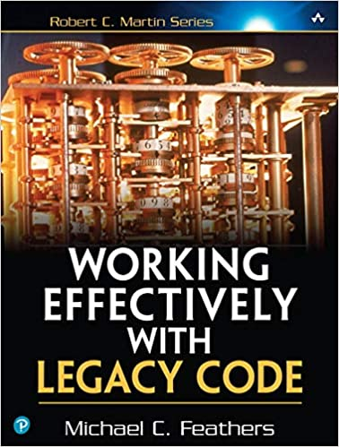

# Clean Code – Direct Way

In this article, I'll show you some tips for all kinds of challenges. These tips will help you write clean code.

Clean Code is a very important thing that all programmers should be concerned about, as we spend 10x more time reading than writing code, so when we need to write, we have to write clean code.\
\
Before we start, **what is clean code?**

> Clean code always looks like it was written by someone who cares. There is nothing obvious that you can do to make it better. All of those things were thought about by the code's author, and if you try to imagine improvements, you're led back to where you are, sitting in appreciation of the code someone left for you—code left by someone who cares deeply about the craft.
>
> **Michael Feathers**

> _Clean code is simple and direct. Clean code reads like well-written prose. Clean code never obscures the designer's intent but rather is full of crisp abstractions and straightforward lines of control._
>
> **Grady Booch**

Now that you already know what is clean code, let's go to some tips :smile:

1. **Write meaningful names**. Be careful with variables, methods, and class names. They should express what they are.
2. **Write small methods.** If you can't read your entire method on a small screen, probably you should break it.
3. **Keep your code with just one responsibility.** If your classes, or your methods, are doing more than one thing, you probably should refactor it.
4. **Do not include comment lines in your code.** Do not comment out the lines that have code, as the code should be enough. But if you are creating an API, you should document your code, so be careful about the difference between commenting and documentation.
5. **DRY, don't repeat yourself.** Remove duplicated code.
6. **Don't create magic values.** Use Constants when you have a magic number. Magic value is the value that means nothing without context.
7. **Avoid multiple arguments.** If you have more than 3 arguments, you should probably refactor it. Use a context class instead of these multiple arguments.
8. **Use Sonar or a lint tool**. With this type of tool, you can fix small things that you probably didn't notice, and guarantee a standardized code.
9. **Low coupling and high cohesion**. You should know the paradigm of your programming language very well to be able to create a code with low coupling and with high cohesion.
10. **Create unit test.** Unit testing will help you maintain your code better and provide more security for maintenance.

***

If you want to learn more about it, follow these references:

Clean Code: A Handbook of Agile Software Craftsmanship \
\

 Working Effectively with Legacy Code&#x20;
