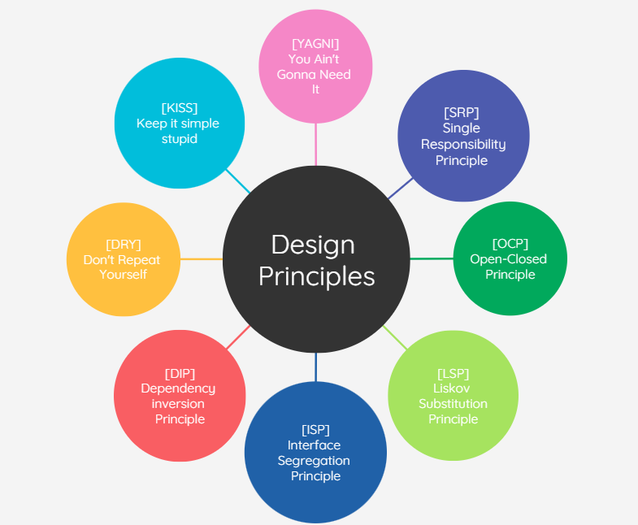

# Write better code with 8 principles

### What are Design Principles? 

Design Principles are crucial to creating a good product. The principles guide good practices for reuse and building cohesion pieces.
