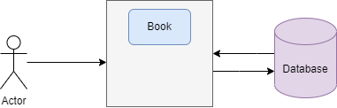
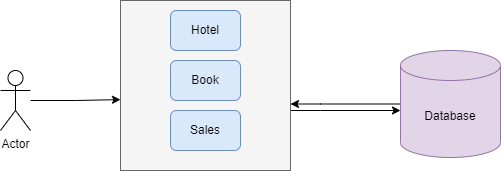
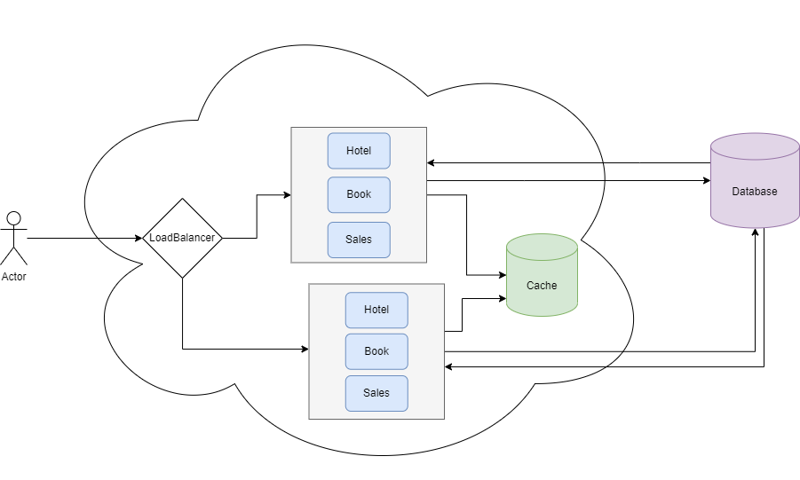
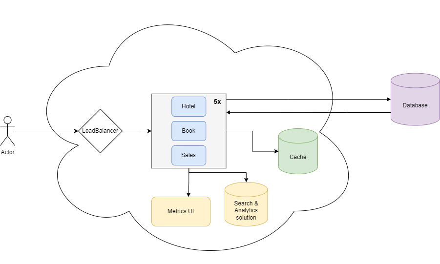
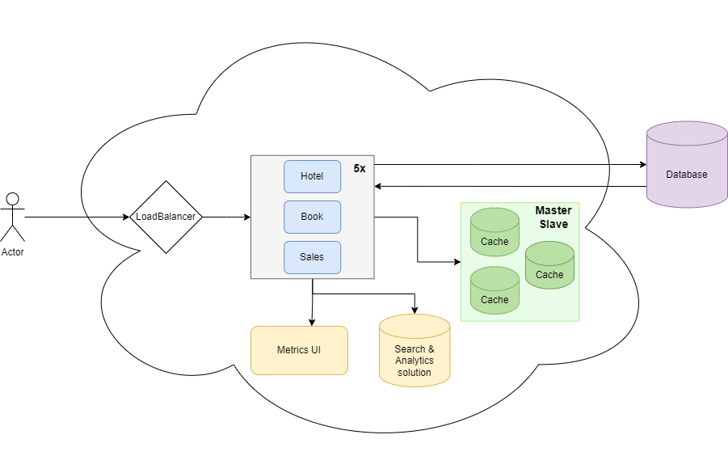

# Architecture of a simple Monolith

### What is a software Architecture?

Software architecture is the organization of a system.

The architecture of a system describes its major components, their relationships (structures), and how they interact with each other.

> “Programming without an overall architecture or design in mind is like exploring a cave with only a flashlight: You don’t know where you’ve been, you don’t know where you’re going, and you don’t know quite where you are.”

Danny Thorpe

In this article, we will talk about the Monolithic.

### What is a Monolithic Architecture?

A monolithic architecture is a traditional model of a software program, which is built as a unified unit that is self-contained and independent of other applications.

A monolithic architecture is a singular, large computing network with one code base that couples all the business concerns together.

### When should I use monolithic?

Monolithic is easy to deal with because it's just a singular application.

They are easy to:

* Deploy, it's just one single application.
* Configure, you don't need to worry about many separated configurations.
* It's just one application to create metrics and logs.
* Usually, it's easy to test and debug

In Martin Fowler's article, he said that:

1. Almost all the successful microservice stories have started with a monolith that got too big and was broken up
2. Almost all the cases where I've heard of a system that was built as a microservice system from scratch, it has ended up in serious trouble.

Based on that, we should think about starting a project with Monolithic.

### When should I not use monolithic?

Of course, Monolithic maybe don't fit well for your project. There are some cases when probably the microservice architecture will be better.

Monolithic is worse to work with:

* Big teams, it's hard to deal with many people
* Development may be slower based on application growth.
* It's hard to scale, with monolith it needs to scale as a whole.
* It's hard to deal with reliability, if there's an error in any part of the system, it could affect the entire application.

There are many systems that use Monolithic and deal with it very well, but of course, everything has advantages and disadvantages.

### Growing a system with monolithic

Before we start, let's see the StackOverflow Architecture: [https://stackexchange.com/performance.](https://stackexchange.com/performance.)

They have a monolithic and have more than 1.3 billion page views per month, so it's possible to have big projects with Monolithic.

Let's think of a hotel system and let's grow it.

1º At the first moment of the application, it will only have a single module inside the monolith and a database.

This is just an MVP with fewer users.\

2º If the application starts growing, it will have more features, but it will keep with simple architecture.

3º If the application continues to grow, it will need to scale our monolith.\
For that, it will need to change to become stateless, it is also necessary to have a cache service and remove the application state. Big refactoring :)

4º If the app continues to grow, it will need more instances, which means it will be harder to see the logs and metrics. So, we will need some application to track metrics and observability.

5º If the application continues to grow, it will have to have more cache instances, or perhaps more database instances, and we will have to change our component architecture to be more resilient, available, and performant to be able to receive more requests.

This kind of approach could go on forever, maybe in some cases, you need to switch to microservices architecture, or perhaps not. It depends on the type of application, size, and budget of the project.

### Conclusion

Monolithic architecture is very useful, and you shouldn't start with microservices architecture because some big companies use it.

There are probably many differences between Netflix, Amazon, and your app. So, most likely, the microservice might not fit well for your application.

Based on the advantages and disadvantages of microservice, you should analyze whether Monolithic fits well in your application or not.

### References

[Stackexchange Architecture](https://stackexchange.com/performance)

[Pattern: Monolithic Architecture](https://microservices.io/patterns/monolithic.html)

[Monolith First](https://martinfowler.com/bliki/MonolithFirst.html)

[Microservices vs. monolithic architecture](https://www.atlassian.com/microservices/microservices-architecture/microservices-vs-monolith)

[Software Architecture Diagramming and Patterns](https://www.educative.io/blog/software-architecture-diagramming-and-patterns)
