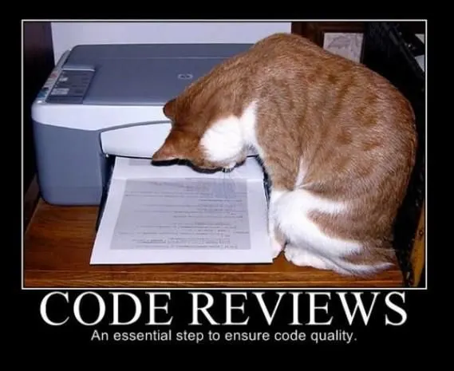
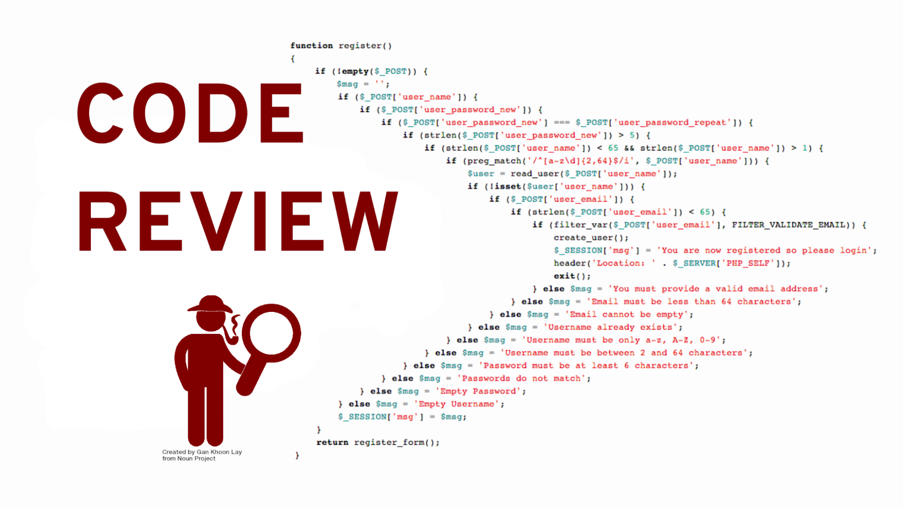
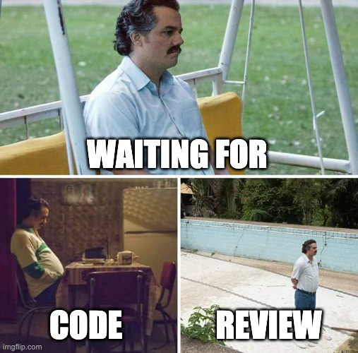
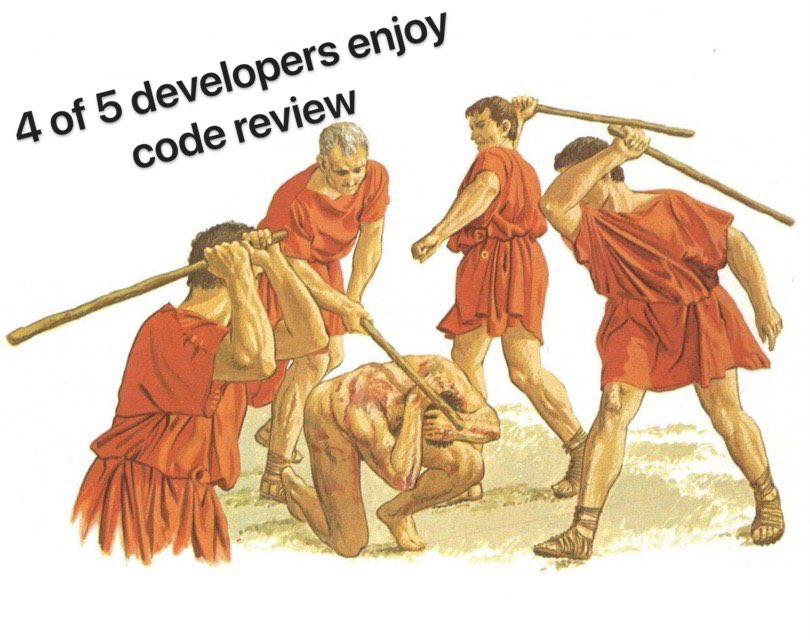

# Code review - Best Practices

<figure><figcaption></figcaption></figure>

### What is code review?

<figure><figcaption></figcaption></figure>

_Code reviews are methodical assessments of code designed to identify bugs, increase code quality, and help developers learn the source code._

After the development, we have the code-review step. This step should be done to get a second opinion about the code, and the solution.

### What is not code review?

Code review, as we already know, is a must step in your delivery pipeline, we have a lot of benefits thanks to code review. However, it’s also essential to understand what is not code review.

**Code review is not:**

* Just one more step on the pipeline
* Step to impose your opinion
* Step with a single proposal to identify bugs.

### What are the benefits of code review?

Great, now that we already know what is code review, let’s see what are the benefits of doing it.

When we are doing code review, we can have some benefits:

* Less code smell
* Less bug
* More knowledge share
* Better code quality
* Enhance security&#x20;

#### How to define a good code review?

Before including this step in your project, it’s important to define some standards, and try to automate the steps that could be done by machine.

#### Check-style

Define a good check style, and write a README teaching how to use it in a local environment, this is crucial to prevent a lot of break pipelines because of code style.

The code style should check for a standard that all developers should follow. Some example:

* Indentation
* Break lines
* Organize Imports

If you want to follow the code style from Google, you can look here: [https://google.github.io/styleguide/](https://google.github.io/styleguide/)

#### Static code analysis

It’s very essential to define a tool to verify the code without a need for a person. This tool will just check for some patterns and rules, to prevent code smell and bugs.

There are numerous tools that do that, you can search for linters, or use Sonar, which does that very well.

#### Test coverage

Defining the code coverage will guarantee that every developer will at least create some tests. Coverage doesn't guarantee you will not have bugs, but will help you a lot.&#x20;

There are many tools to do this, for example, JaCoCo for Java, and you can also use Sonar, which shows code coverage more beautifully, but it depends on another tool, like JaCoCo.

#### SAST

SAST or Static Application Security Testing is a way to verify security against static code. There are many security issues that can be encountered using a SAST tool. In the case of Java it can also be helpful to check for dependency vulnerabilities.

Sonar can also be used for that, but maybe it’s not the most useful for this case. Another great tool is Snyk&#x20;

#### Changelist

Define a standard template for your pull request(PR), this will help the developers to see the change list easier.&#x20;

### What should I check during the code review?

* Design: Does the code fit well in the design of this application? Is now a good time to add this functionality?
* Functionality: Does the code work as the developer intended? Is what the developer intended good for the users of this code?&#x20;
* Complexity: Is the code easy to understand? Does the code have any kind of complexity that can be minimized?
* Tests: Are there enough tests to guarantee the expected behaviour? The tests are following best practices to be clear for other developers?
* Naming: Is there anything unclear, method, variable, or class name that can be changed?
* Comments: Are there any comments, or should there be any comments, in this code?
* Style Consistency: Does the code follow the code style?
* Documentation: Is there any documentation to clarify what was done if it should?
* Non-functional requirements: Does the code respect the non-functional requirements? How about safety, performance, usability, concurrency…\

### Best practices for doing code review

#### Assertive:

You are checking the user code, be careful with “you”

&#x20;❌ "You have done it wrong ..."

&#x20;✅ "The way the code is written, we have an error..."

#### Standard vs Personal taste:

Define a standard to be followed for the team. \

&#x20;❌ "Review based on personal taste ..."

&#x20;✅ "Review based on standard already defined."

#### Agile:

Identify as many adjustments as possible at once, this will help generate a more dynamic flow.\

&#x20;❌ "Open new adjustment after each review"

&#x20;✅ "Open all the adjustments in a single flow"

PS: Beware, if you open many tweaks it will make the PR owner unmotivated

#### Clarity:

When identifying something that can be improved, or repaired, try to be clear in the description or request.

&#x20;❌ "This code is wrong. Why did you do that?"

&#x20;✅ "This code seems to be wrong, we have this problem: \<Problem>, we can solve it by doing this \<Possible Solution>"

If you have just an opinion about the subject but is an opinion, you should make it clear.

&#x20;❌ "I think we can use regex in this case."

&#x20;✅ "Optional: Use regex, \<Explanation why use regex>"

You and your team can define some tags related to the comments, for example:

**Could**: Used only as suggested

**Should**: Used as a suggestion that has to be well evaluated.

**Must**: It needs to be fixed, it's serious.

**Nit**: Used for small things

**Optional**: Used for optional changes

**FYI**: Used for more informational purposes and may or may not currently apply.

#### Collaborative:

Code review shouldn't just be done by more senior developers.

More junior developers should control the code review performed by more senior developers.

&#x20;❌ "Senior review Mid-level, Mid-level review Junior, and Junior do not review "

&#x20;✅ "Everyone reviews the code. If you don't feel comfortable accepting the review, just don’t do it"

#### Review duration:

Delimit a time or a maximum number of revisions.

This will help provide that everyone can do this activity.

#### Praise:

Positive reinforcement helps keep time more motivated and productive.

The recognition of something done is rewarding.

### Best practices receiving the review

1. **Do your own code review:**  Before asking, or opening to code review, do it by yourself. Be sure that your PR is ready for review.
2. **Avoid big PR:** You should avoid big PR, or if you need to do a big PR, do it with pair programming or with near communication with a colleague, so it will be easier to review.
3. **Follow the standard created for your PR:** Remember the change list style that we discussed previously, you should follow it, and you also need to do that in your PR:

* Describe shorty what you have done
* Guarantee that all tests are running, and working fine
* Guarantee that your codes are following the code-style

4. **Humility**: You have to be humble, technology changes all the time, and we have to recognize that there are better ways to solve the same problem.
5. **Read vs Write**: We spend 80% of our time reading code and 20% writing. So keep in mind that some syntax improvement can have a big impact in the long term.

### Conclusion

Code review should not be just one more step in your pipeline, which no one wants to do.

It should not be something like this:

<figure><figcaption></figcaption></figure>

It should be something like this:

<figure><figcaption></figcaption></figure>

This is only a joke 😂

Code review is a crucial step that helps the team be more collaborative. Code review helps the team to be more in sync and also to get to know the team better.

Finally, the code review is also a great way to make the code more comprehensive, the code will follow a standard that all the developers will know.&#x20;

Hope with this you are more open to code reviews and also make better code reviews 🙂

### References

* [What is a code review?](https://about.gitlab.com/topics/version-control/what-is-code-review/)
* [Code Review](https://openpracticelibrary.com/practice/code-review/)
* [Boas práticas de Code Review para bons programadores](https://dev.to/christiantld/boas-praticas-de-code-review-para-bons-programadores-3999)
* [What to Look for in a Code Review](https://leanpub.com/whattolookforinacodereview)
* [Why code reviews matter (and actually save time!)](https://www.atlassian.com/agile/software-development/code-reviews)
* [Good Code Reviews, Better Code Reviews](https://blog.pragmaticengineer.com/good-code-reviews-better-code-reviews/)
* [Google Engineering Practices Documentation](https://github.com/google/eng-practices)
* [How to Do Code Reviews Like a Human (Part One)](https://mtlynch.io/human-code-reviews-1/)

\
\

\

\
\

\
