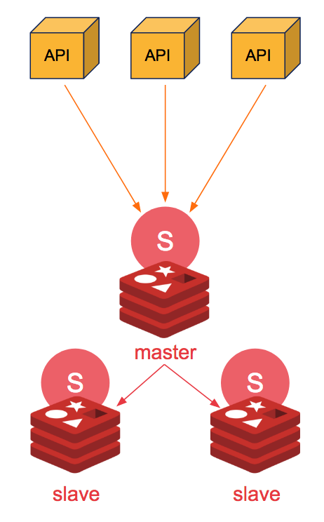
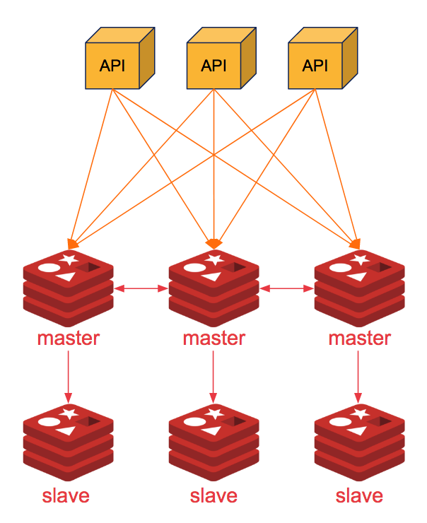

# Redis architecture


There are 3 common architectures for using Redis:

#### 1. Master-Slave

Using master-slave, in which only the master is responsible for writing, and the others only for reading.

In this architecture, the application will communicate with a LoadBalancer that will be responsible for sending a request to the corresponding node.

If written, it will be sent to the Master.\
If read, it will be sent to the available node according to LoadBalancer logic.

NOTE: If the Master becomes unavailable, Redis will stop responding.


#### 2. Master-Slave with Sentinel

In this architecture it works similarly to Master-Slave, the big difference is that a Sentinel instance will be created for each Redis instance.

Sentinel is responsible for identifying who is the master, and if there is a problem with the master, it will elect a new master.



#### 3. Redis Cluster

Using shared architecture, you will have multiple masters

This Architecture is the most complex, in which several masters and slaves are created.

For correct use, it is necessary for the application to know who the Cluster nodes are.



#### Advantages e Disadvantages

| Information           | Master-Slave | Sentinel | Redis Cluster |
| --------------------- | ------------ | -------- | ------------- |
| **Configuration**     | Easy         | Medium   | Hard          |
| **Write Performance** | Medium       | Medium   | High          |
| **Data Consistency**  | High         | High     | Medium        |
| **High Availability** | Low          | High     | High          |

### Quick Guide

1. Install Redis with Kubernetes using Helm [https://github.com/bitnami/charts/tree/master/bitnami/redis ](https://github.com/bitnami/charts/tree/master/bitnami/redis):

```
helm repo add bitnami https://charts.bitnami.com/bitnami
helm install my-release \
  --set auth.password=secretpassword \
  --set sentinel.enabled=true \
    bitnami/redis
```

1. Access the Redis:

`kubectl port-forward --namespace default svc/my-release-redis 6379:6379`

1. Start the application:

OBS: The application is with Java 10, and with Lombok.\
This application is using the first Architecture (Master-Slave).

```
git clone https://github.com/redis-developer/basic-redis-chat-app-demo-java
cd basic-redis-chat-app-demo-java
mvn clean install
mvn spring-boot:run
```

### Referência

* [Difference between the architectures Redis](https://rtfm.co.ua/en/redis-replication-part-1-overview-replication-vs-sharding-sentinel-vs-cluster-redis-topology/)
* [Redis Sentinel Documentation](https://redis.io/topics/sentinel)
* [Bitnami Redis Cluster - master-slave cluster with Redis Sentinel](https://engineering.bitnami.com/articles/deploy-and-scale-a-redis-cluster-on-kubernetes-with-bitnami-and-helm.html)
* [Redis Cluster Specification](https://redis.io/topics/cluster-spec)
* [Redis Cluster high availability architecture](https://success.outsystems.com/Support/Enterprise\_Customers/Installation/Configuring\_OutSystems\_with\_Redis\_in-memory\_session\_storage/Redis\_Cluster\_high\_availability\_architecture)
* [Production Checklist for Redis on Kubernetes](https://medium.com/swlh/production-checklist-for-redis-on-kubernetes-60173d5a5325)
* [Redis on Kubernetes Labs](https://docs.redislabs.com/latest/platforms/kubernetes/getting-started/quick-start/)
* [Example Java Project](https://developpaper.com/understanding-springboot-integration-in-redis-cluster-environment/)
