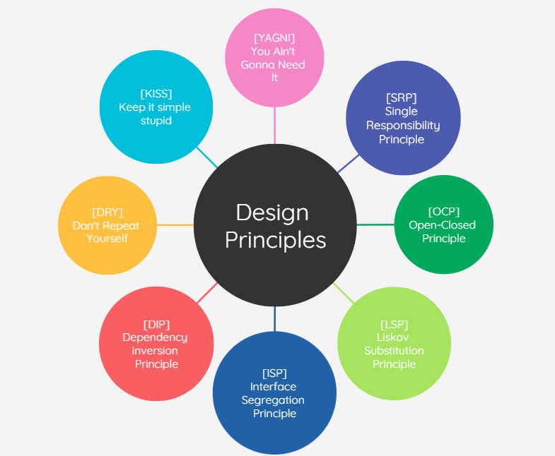
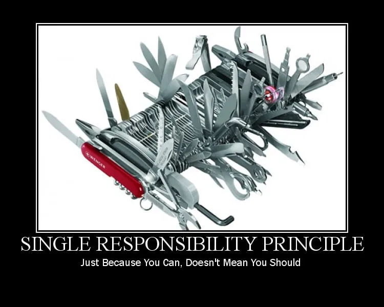
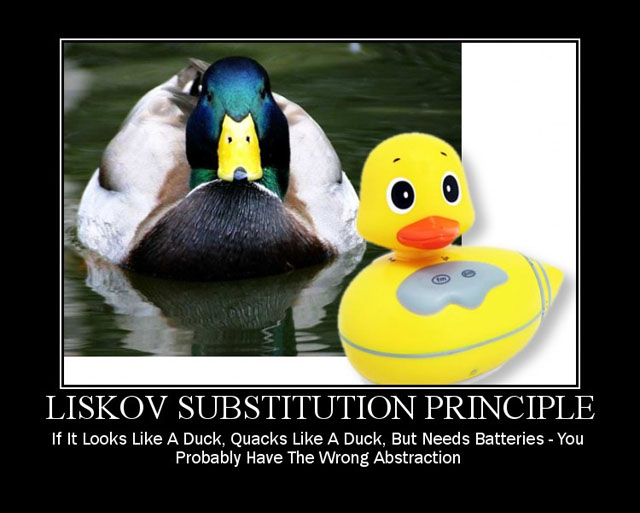
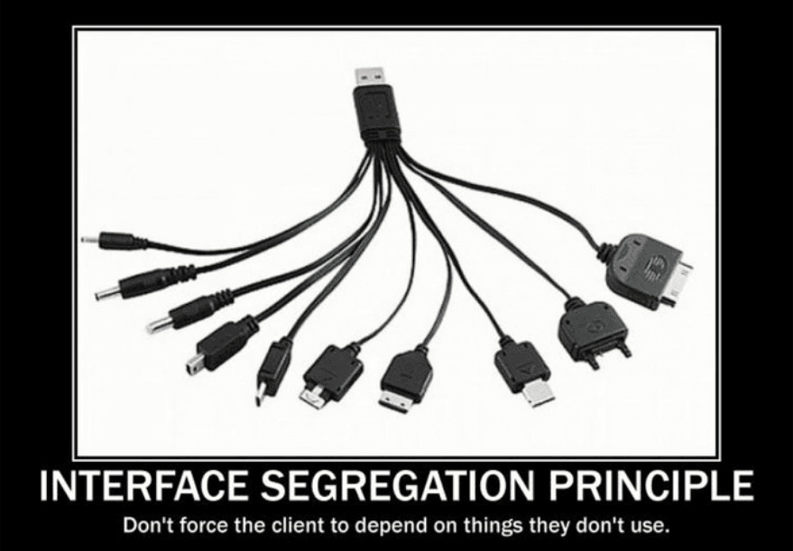
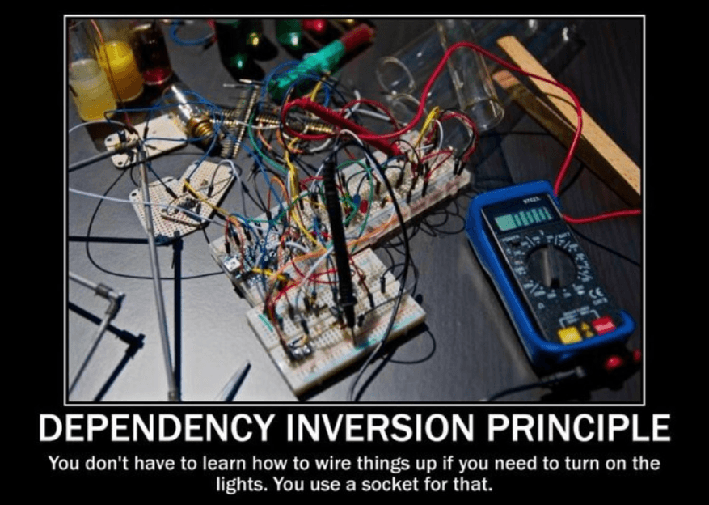
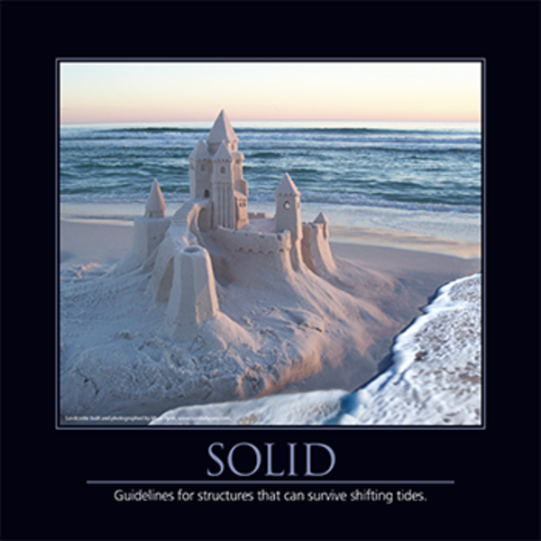
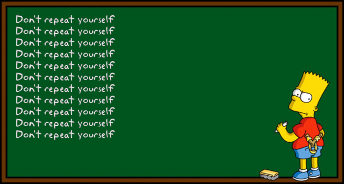
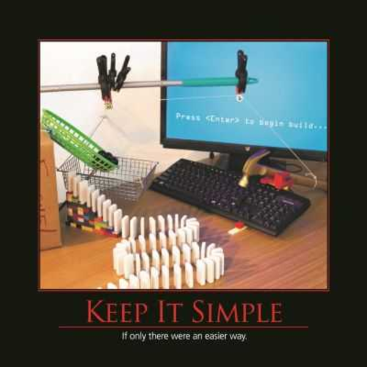

# Write better code with 8 principles

### What are Design Principles?

Design Principles are crucial to creating a good product. The principles guide good practices for reuse and building cohesion pieces.

A building with beautiful architecture but bad bricks will not result in good construction. On the order side, if we have good bricks and good architecture, but the interconnection between the bricks is not of good quality, the construction will not be satisfactory either.

That's why the principles are so important because they are this interconnection between the bricks.

### \[SRP] - The Single Responsibility Principle

"Gather together the things that change for the same reasons. Separate things that change for different reasons."\
\- Robert C. Martin

### \[OCP] - The Open-Closed Principle

"A Module should be open for extension but closed for modification."\
\- Robert C. Martin

.png>)

### \[LSP] - The Liskov Substitution Principle

"A program that uses an interface must not be confused by an implementation of that interface."\
\- Robert C. Martin

### \[ISP] - Interface Segregation Principle

"Keep interfaces small so that users don’t end up depending on things they don’t need."\
\- Robert C. Martin

### \[DIP] -The Dependency Inversion Principle

"Depend on the direction of abstraction. High-level modules should not depend upon low-level details."\
\- Robert C. Martin

### SOLID

SOLID is an acronym that contains the five principles described above.\
\
The SOLID is these 5 principles that Robert C. Martin compiled from his learning and with other professionals.\
\\

### \[DRY] - Don't repeat yourself

The goal of the DRY is to reuse the code written before.\
\
"Every piece of knowledge must have a single, unambiguous, authoritative representation within a system"\
\- Andy Hunt and Dave Thomas, The Pragmatic Programmer

### \[KISS] - Keep It Simple, Stupid

The KISS Principle states that things work better if they are kept simple, instead of complicated.

### \[YAGNI] - You Ain't Gonna Need It

Always implement things when you really need them, never when you just anticipate you need them.

### Conclusion

In this article, I show you 8 principles that will guide you to write better solutions in your code. Keep these principles in mind and use them when you need to.

Don't try to overload your application by trying to apply all these principles everywhere. They are very important, and you will probably need some of them most of the time, so use them wisely.

### References

**Clean code**\
\- Robert Cecil Martin

**The clean coder**\
\- Robert Cecil Martin

**Clean Architecture**\
\- Robert Cecil Martin

**The pragmatic programmer**\
\- Andy Hunt, Dave Thomas

**Test-driven Java Development**\
\- Viktor Farcic, Alex Garcia

**Extreme Programming Explained**\
\- Kent Beck, Cynthia Andres
